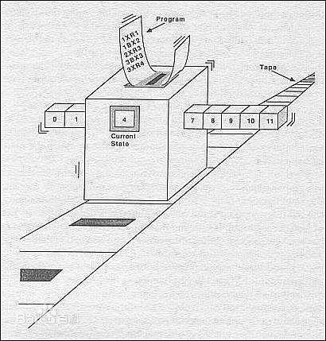
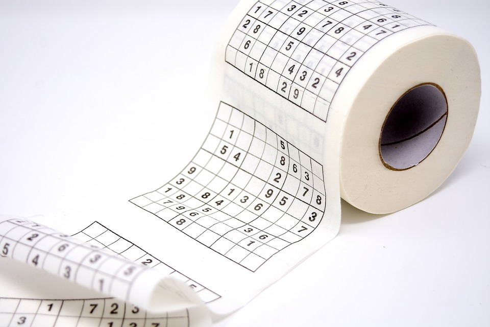

#  从人类智慧到人工智能

## 1 关于人类智慧原理的讨论
### 1.1 图灵机与图灵测试
我们在江苏卫视《最强大脑》中可以看到很多神人：做快速大数开方运算的中国雨人周玮，短时间记忆的世界冠军王峰，细微观察的水哥王昱珩等等（作弊的那几位自动忽略）。他们分别展示了计算能力，短时记忆能力，微小观察力。我们不禁对人类的智慧的感到惊奇。智慧究竟是什么？人类智慧的原理究竟是什么？
二十世纪初，以英国数学家艾伦·麦席森·图灵（Alan Mathison Turing）为代表的科学界大多有这样一个观点：人体是一台机器，“虽然比任何手工制作的机器都要复杂千万倍，但其本质上仍然是一台机器。”依现在的科学看，这种论点的正确性值得商榷，但该论点对现代科学发展的正向性是不容否认的。不过图灵研究的主体不是人，而是模仿人脑的机器。图灵认为我们可以用机器来模拟人脑进行数学运算的过程。在这个思想的引导下，艾伦·图灵在1936年提出了“图灵机”理论。原版的图灵机很复杂，我们将其精简一下：

> 设想有一条无限长的纸条，纸条上有一个个方格，每个方格可以存储一个符号，纸条可以向左或向右运动。现在有一台机器，机器的探头指向一个方格以便读取该格子的符号。图灵机可以做下面三个基本的操作：
> 1. 读取指针头指向方格的符号。
> 2. 修改方框中的字符。
> 3. 将纸带向左或向右移动，以便修改其临近方框的值。

  
我们可以拿出上厕所用的卫生卷纸来类比这个过程。卷纸可以当做上文中无限长的纸带子。卫生纸上的9\*9数独是一个大格子。（注意我说的的是一道9\*9数独题，不是一道数独题中的小格子，不要问我卫生纸上为什么有数独，卫生纸上有数学题不是常识吗?）
人就是一台机器，我们可以对卫生纸做三个动作：
1. 看一道数独题。
2. 在一道数独题上勾勾画画（这里的勾勾画画包括修改数独题本身，甚至包扣抹去数独题目自己画个猫。）
3. 将卫生纸卷动，看前一道题或后一道题，以便对前一道题或后一道题进行勾勾画画。
这么看来图灵机的确模拟了我们在蹲坑时“不看手机”，“热爱数学”，“思考人生”的人脑活动与行为。别小看这三个操作，他们分别代表了：机器输入，机器输出，机器指令移动。给图灵机置入三种操作的排列组合，就可以让图灵机做很多炫酷事情。按照现在的观点：对纸带的操作叫“计算机指令”；对这种排列组合叫做“算法”。（当然图灵机纸带格子上没有放数独，而是符号。）



图灵又设想：“假如有一台计算机，其运算速度非常快、记忆容量和逻辑单元的数目也超过了人脑，而且还为这台电脑编写了许多智能化的程序，并提供了合适种类的大量数据，那么，是否就能说这台机器具有思维能力呢?”1950年10月，图灵发表一篇题为《机器能思考吗》的论文，提出了著名的**图灵测试**：如果一台机器能够与人类展开对话（通过电传设备）而不能被辨别出其机器身份，那么称这台机器具有智能。二十世纪五十年代的计算机算力与人工智能算法水平，机器通过“图灵测试”很困难。七十多年后的今天，计算机硬件、软件、算法的大发展使得“图灵测试”机器的建造变为可能。


### 1.2 计算机的爸爸们 

我要向大家介绍两位被称为“计算机之父”：英国人的艾伦·麦席森·图灵（Alan Mathison Turing）和美国籍匈牙利裔冯·诺依曼（John von Neumann）。不要计较计算机为什么有这么多爹，我们关注的是他们为现代计算机的发展具体做了什么。

一个没有经过特殊训练普通人不太可能达到这种状态。但是借助计算机或外部器材，我们都能达到他们的能力。


第二次世界大战进行期间，为了抢先轴心国阵营研制新型大炮和导弹，美国军方要求“弹道研究实验室”每天为陆军炮弹部队提供6张射表以便对导弹的研制进行技术鉴定。为了满足复杂的弹道计算需要。宾夕法尼亚大学莫尔电机工程学院的莫希利（John Mauchly）借鉴阿塔纳索夫-贝瑞计算机（Atanasoff–Berry Computer）中电子数字计算机的主要构件思想，于 1942年提出了试制第一台通用型现代电子计算机的设想。直到二战结束，1946年2月14日，世界第一台通用电子计算机ENIAC才在美国宾夕法尼亚大学诞生。

图灵设计的密码破译机在一定程度上影响了“二战”的格局。但是图灵的人生却非常悲惨，1952年，英国政府对图灵的同性恋取向定罪，随后图灵在坐牢与雌激素注射。1954年6月7日，图灵把一个泡过氰化物的苹果咬入口中，告别世界。
图灵是一位同性恋，这原本没有错，但不幸的是，当时的社会视同性恋为异端。图灵被当局强迫注射雌激素，导致身体遭受了极大的创伤。最后图灵不堪其辱，吃了一个含有氰化物的苹果，自杀身亡。

提出了计算。为什么。我这里说的不是，而是计算机的数制采用二进制；计算机应该按照程序顺序执行

二十一世纪，计算机设备已经进入千家万户。金庸先生的《鹿鼎记》全文约三四百万字，用编码存储不过3M-4M，相当于现在智能手机拍摄的一张照片大小。这种量级的存储，现代设备在一瞬间就“记录”下来了，但是对于普通人却“记忆”不下来。婚礼上热闹繁华，所有人，但是通过一台摄像机都可以记录下来。

计算机还可以连接摄像头，只要摄像头分辨率足够高，计算机的观察能力也会超过普通人类。

我们在江苏卫视《最强大脑》中可以看到很多神人。中国雨人周玮，世界记忆冠军王峰，水哥王昱珩等等。他们分别展示了计算能力，短时记忆能力，微小观察力。一个没有经过特殊训练普通人不太可能达到这种状态。但是借助计算机或外部器材，我们都能达到他们的能力。

| 智能种类     | 人类 vs 人工智能                                        |
| ----------- | -----------------------------------------------------|
| 记忆能力     | 人类记忆能力不如存储设备精确高，量级大                      |
| 观察能力     | 只要摄像头分辨率高，超过人类视觉不成问题                    |
| 计算逻辑能力 | 计算机的计算速度远远超过人类；计算机的逻辑计算不会错           |
| 想像学习能力 | 人类可以举一反三具有广泛想像学习能力，计算机需要对单一服务进行编程后才能执行 |

记忆，计算，观察这三种人类的能力可以很好地被计算机超越后，计算机好像应该获得更高的智商，但是事实绝不是这样。计算机没有自我产生认知的能力，因此机器也就不会产生想象力。没有想象力，也就没有对**新问题**的解决方法。
因此，在初期计算机编程时，我们必须制定很复杂的规则来使计算机尽可能地适应各种问题，让计算机看起来很智能。（如同下面使用switch case语句穷举条件，适用不同的计算）这就是人工智能的开始。


```c
switch(c)
	{
     	case '+': d=a+b;
           printf("计算值为 %d",d); break;
     	case '-': d=a-b;
           printf("计算值为 %d",d); break;
     	case '*': d=a*b;
           printf("计算值为 %d",d); break;
     	case '/': d=a/b;
           printf("计算值为 %d",d); break;
     	case '%': d=a%b;
           printf("计算值为 %d",d); break;
    }
```
这种穷举的方法直到今年（2019年）仍然是最常用，最简单那的方法。我们经常看见一段代码几十个，几百个if else语句。但这种做法很难令人满意。代码很可能经常重改，一旦重改就会重新编译；最重要的是：穷举常常是举不到终点的。

如何让计算机产生对新事物的认知（即认识不断出现的新生事物）是一件极其困难的事。**我们将“获得知识、技能或认知的过程”叫学习，“计算机得知识、技能或认知的过程”的过程称为机器学习。**


1.2 抽象能力：用“简单特征”解释“复杂现象”

1.3 创造能力：提出“方法”有效地解决问题

1.4 现阶段AI局限性